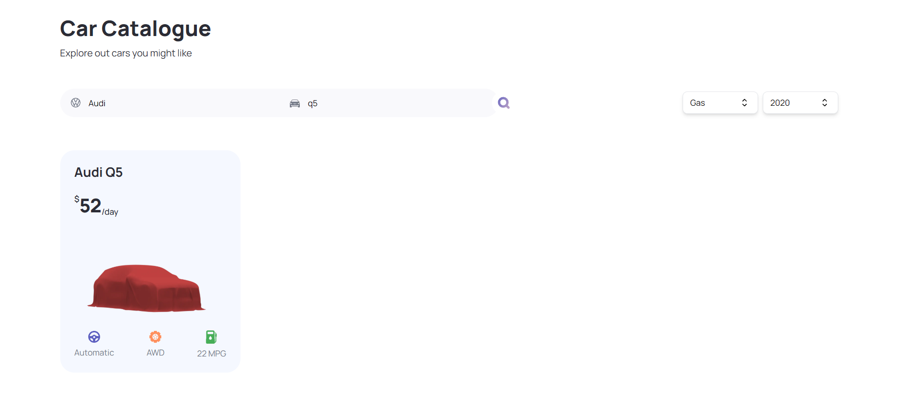
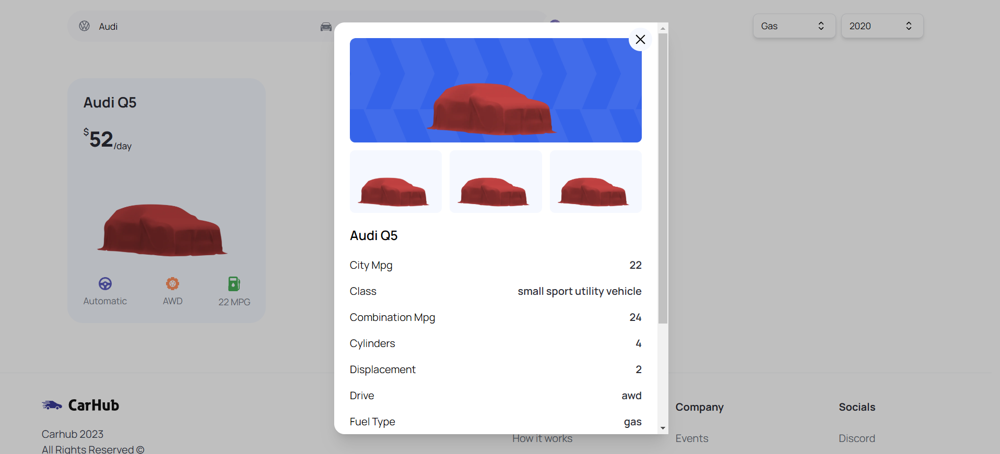
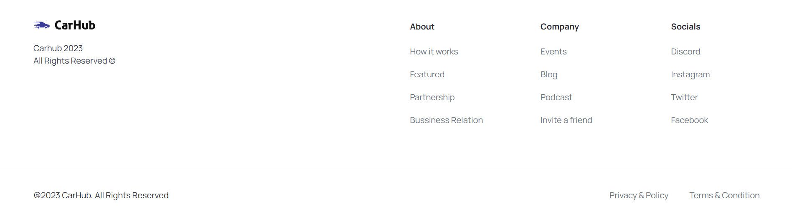

  <h1>
    Car Showcase Clone Coding
  </h1>

  

    
    
  

   

  

    This repository is based on tutorial by 
    <a href="https://www.youtube.com/@javascriptmastery" target="_blank">JavaScript Mastery</a>  
    <a href="https://www.youtube.com/watch?v=pUNSHPyVryU" target="_blank">Build and Deploy a Modern Next.js Application | React, Next JS, TypeScript, Tailwind CSS</a>
  

   

  
  
hero

  
  
catalogue

  
  
details

  
  
footer

